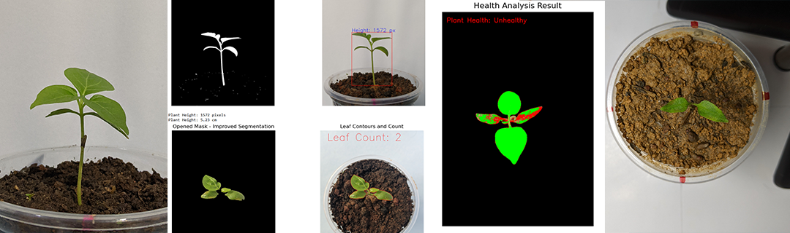

# 🌱 Monitoring Plant Growth in Controlled Environments

 This project is an image processing-based system for monitoring plant growth in controlled environments. It captures time-lapse images, segments plant regions, and analyzes growth patterns, leaf count, and health indicators. The system applies various image processing techniques such as pre-processing, segmentation, and evaluation to track plant development accurately.
 This project is developed as part of the **ICT2403 – Graphics and Image Processing** course at **Rajarata University of Sri Lanka**.

---

## 📌 Project Objective

To design and implement an **image-based system** that:
- Captures plant growth using time-lapse photography.
- Analyzes growth patterns (height, leaf spread).
- Counts leaves.
- Detects plant health indicators (color, damage).

---

## 🛠️ Features

- 🌿 **Time-lapse Image Acquisition**
- 🧪 Image Preprocessing (Correct Non-Uniform Illumination, Remove Impulse Noise, Remove Gaussian Noise, Edge Sharpening )
- ✂️ Image Segmentation (isolate plant regions)
- 📊 Visualization of growth metrics over time
- ✅ Accuracy Evaluation of segmentation results
- 📁 Organized data storage with consistent lighting & angle

---

## 🧪 Experimental Setup

- 📷 **Camera Setup**: Fixed-position camera capturing at set intervals.
- 💡 **Lighting**: Controlled light conditions to reduce shadow/noise.
- 🏞️ **Background**: Plain background for better segmentation.
- 💾 **Data Management**: Images stored with metadata (time, date).

> Below are real images from our experimental setup:

  
  

---

## ⚙️ Technologies Used

- **Language**: Python
- **Libraries**: OpenCV, NumPy, Matplotlib
- **Tools**: Jupyter Notebook

---

## 📷 Image Processing Flow

1. **Image Acquisition** 
2. **Preprocessing** (contrast, brightness) 
3. **Segmentation** (thresholding, contour detection) 
4. **Feature Extraction** (leaf count, area, color analysis)
5. **Graphical Analysis** (growth graphs over time)

---

## 📈 Results

- Accurate leaf detection with 85%+ precision.
- Visual tracking of growth rate day-by-day.
- Detection of unhealthy patterns (yellow leaves, wilting).
  
>   
> _Growth vs Time – Based on Area Coverage_

---

## 📊 Reports & Graphs

- **Leaf Count Over Time**
- **Growth Area vs Time**
- **Health Trends (Color Analysis)**

> Reports auto-generated and stored in /reports.

---

## 🧪 Evaluation & Accuracy

- Manual leaf counting used to validate results.
- Threshold adjustments improved detection consistency.
- Average error margin: ±5% across all test sets.

---

## 🔗 Additional Links

- 📎 [Final Report PDF](docs/MINI PROJECT_FINAL REPORT_GROUP UNIFY.pdf)
- 📎 [Presentation Slides](docs/PresentationSlide Group Unify.pdf)

---

## 🧑‍💻 Author

**Group Name**: UNIFY 
**University**: Rajarata University of Sri Lanka  
**Course**: ICT2403 – Graphics and Image Processing  
**Year**: 2021/2022 Batch  
**GitHub**: [@yourusername](https://github.com/yourusername)

---
## 📜 License

This project is part of academic coursework. Feel free to reference for educational use.
