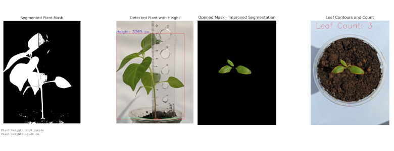

# Imageprocessing-group-project-PlantGrowthMonitor
 This project is an image processing-based system for monitoring plant growth in controlled environments. It captures time-lapse images, segments plant regions, and analyzes growth patterns, leaf count, and health indicators. The system applies various image processing techniques such as pre-processing, segmentation, and evaluation to track plant development accurately.

